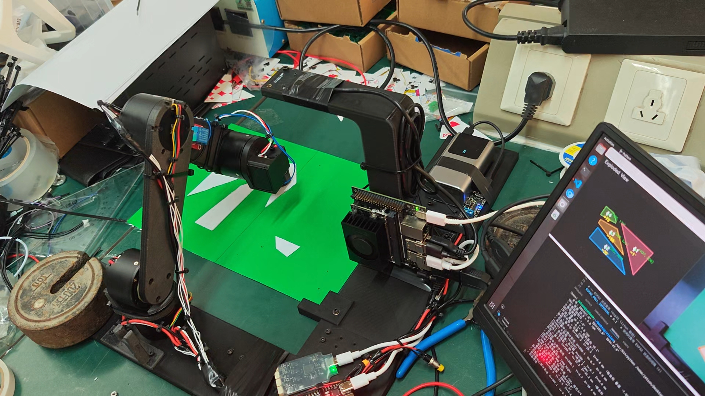

# JigsawArm — 四轴机械臂视觉拼装系统

基于 **Jetson + YOLOv8 实例分割** 的四轴机械臂视觉拼装系统:摄像头实时识别散落的碎片 → 算法自动拼接并生成爆炸图 → 机械臂按坐标抓取、搬运、旋转放置,完成装配。全程无需人工干预坐标,`read` 一条命令跑完整流程。

<div align="center">

[](https://www.bilibili.com/video/BV1Ag3Q6mEnW)

**▶ 完赛演示**:点击封面播放《26电赛E题机械臂完赛视频》,96 秒实拍展示机械臂自动拼装的完整流程。

</div>

## 项目简介

本项目是 **2026 年全国大学生电子设计竞赛(26 电赛)E 题** 作品代码库,基于 Jetson 平台实现图像识别、碎片拼接与机械臂自动装配等核心算法:

- **图像识别**:基于 YOLOv8 实例分割,实时识别散落碎片的轮廓与顶点
- **拼接算法**:DFS 回溯匹配边长度、面积比值与四边形角度,自动还原完整拼图并生成爆炸图
- **机械臂装配**:按拼接结果规划抓取、搬运、旋转与放置,自动完成装配

```
摄像头实时 YOLO 分割识别碎片
        │
        ▼
拼接 (DFS 回溯匹配边/面积/角度) + 爆炸图布局
        │
        ▼
输出每个碎片:原始坐标 → (爆炸图坐标, 旋转角)
        │
        ▼
机械臂 抓取 → 搬运 → 舵机旋转 → 放置, 完成装配
```

## 功能特性

- **GPU 实时分割**:YOLOv8 实例分割,GStreamer 硬件加速采集(640×480 @ 60fps),PyTorch CUDA 推理
- **跨帧时域平滑**:碎片顶点按轨迹做 EMA 平滑,抗单帧抖动
- **自动拼接算法**:DFS 回溯 — 边长度匹配 + 面积比值 + 四边形角度三重校验,输出对齐后的完整拼图
- **爆炸图布局**:碎片沿"整体中心→碎片中心"方向推出至外扩包围盒,直观展示每块的放置位置
- **一键装配**:`read` 流程连续采集 10 帧 → 平滑 → 拼接 → 爆炸图 → 独立进程弹窗三合一图,并输出每个碎片的抓取坐标、放置坐标与旋转角
- **绝对坐标控制**:控制台支持毫米级绝对笛卡尔坐标与相机像素坐标(仿射标定,残差 ~0.2mm)双模式
- **基座旋转 → 舵机反向补偿**:基座转动时工具自动反向补偿,保持被抓物体绝对姿态、防止线材缠绕
- **在线调参**:`pid_tune.py` 支持 GIM4310 位置/速度环 PID 在线读取、调整与掉电保存

## 系统架构

```
main_logic.py (业务/控制台) → arm_driver.CartesianArm (笛卡尔级)
    → arm_driver.Arm (电机级) → GIM4310_driver.MotorBus (RS485 总线)
```

- **笛卡尔级** (`CartesianArm`):`move_tool_to` / `move_camera_to`(像素→坐标)/ `go_standby` / `go_home`,分段移动与分关节延时,基座旋转→舵机补偿回调
- **电机级** (`Arm`):关节限位、上电编码器偏置检测、手腕水平参考(ID4 自动维持水平)
- **视觉** (`infer.py` + `reassemble.py`):YOLOv8 分割、顶点平滑、拼接、爆炸图

## 硬件与通信(三路串口 + 摄像头)

| 设备 | 协议/端口 | 说明 |
|---|---|---|
| 4× GIM4310 关节电机 | RS485, 115200, 8N1 | ID1 基座 / ID2 肩 / ID3 肘 / ID4 腕,协议见 `自定义RS485通信协议.md` |
| Feetech STS 工具旋转舵机 | 半双工 TTL, 1Mbps, ID=1 | 正 = 逆时针 |
| ESP32 | 115200, 自动检测端口 | 继电器(电磁铁抓取) + 红绿状态灯 |
| USB 摄像头 | /dev/video0, GStreamer | MJPG 硬件加速, 60fps |

> ⚠ 摄像头**不要两个进程同时打开**(实时窗口与 `read` 流程会互相抢占)。

## 环境依赖

- NVIDIA Jetson(带 CUDA 的 PyTorch)
- Python 3 + PyTorch (GPU) + ultralytics + OpenCV + pyserial + numpy

⚠ 必须使用带 GPU torch 的解释器(如 `/usr/bin/python3`),CPU 版 torch 无法实时推理。

## 快速开始

```bash
# 1. 单图拼接 + 爆炸图测试(无需硬件, 最快的验证方式)
/usr/bin/python3 reassemble.py <image_path>      # 输出 reassembled.jpg / exploded.jpg

# 2. 实时分割窗口
/usr/bin/python3 infer.py                        # q 退出 / s 截图 / r 跑 read 流程 / t 平滑开关

# 3. 主程序(启动流程 + 控制台控制, 需硬件)
/usr/bin/python3 main_logic.py                   # 自动检测 ESP32 串口
/usr/bin/python3 main_logic.py --esp-port /dev/ttyUSB0
/usr/bin/python3 main_logic.py --no              # 调试模式: 跳过视觉
```

### 控制台指令(main_logic.py)

| 指令 | 说明 |
|---|---|
| `<X> <Y> [Z]` | 绝对笛卡尔坐标(mm),Z 缺省保持当前 |
| `n <u> <v> [Z]` | 相机像素坐标 → 执行器坐标后移动 |
| `action` / `put` | 下降到抓取高度 → 继电器吸合/释放 → 回升 |
| `trans <u> <v> [角度]` | 搬运: 抓取点 → 放置点 → [舵机旋转角度] → 放下 |
| `transport <u1> <v1> <u2> <v2> [角度]` | 同 trans,放置点显式指定 |
| `r <角度>` | 舵机相对转动(正 = 逆时针) |
| `read` | 跑完整装配流程(等价于 infer.py 按 R) |
| `t1 ~ t4` | 把 read 输出的第 N 个碎片数据直接传入 transport 执行 |
| `home` / `standby` | 回到待机位置 |
| `ready` | 移动到准备位置 |
| `status` | 显示当前位置 |

`read` 输出格式:`#N(原始坐标)-(爆炸图坐标, 旋转角)`,旋转角约定**顺时针为正**,可直接作为 `trans` 角度使用。

## 项目结构

| 文件 | 作用 |
|---|---|
| `main_logic.py` | 主程序:启动流程 + 控制台指令解析 + 所有动作序列常量 |
| `arm_driver.py` | 机械臂驱动:FK/IK、极坐标换算、工具偏移、相机标定仿射 `CAMERA_A`、`Arm`(电机级)/`CartesianArm`(笛卡尔级) |
| `GIM4310_driver.py` | GIM4310 电机 RS485 驱动(`MotorBus`,地址 1-4) |
| `servo_driver.py` | Feetech STS 串口舵机驱动 |
| `infer.py` | YOLOv8 GPU 实时推理、顶点跨帧 EMA 平滑、`run_read_pipeline`(read 全流程) |
| `reassemble.py` | 碎片拼接(DFS 回溯)、爆炸图、三合一图 |
| `camera_driver.py` | 相机查看工具 |
| `host_test.py` | ESP32 串口通信测试 |
| `pid_tune.py` | GIM4310 PID 在线调参工具 |
| `view_image.py` | 独立进程图片查看器(infer 弹窗调用) |
| `自定义RS485通信协议.md` | GIM4310 RS485 自定义协议文档 |

## 关键约定

- **坐标系**:FK 镜像约定 `x = -r·cos(θ1), y = r·sin(θ1)`;基座角**增大 = 从摄像头视角看顺时针**
- **方向**:舵机**正 = 逆时针**;`read` 输出的旋转角**顺时针为正**(已在 `reassemble.py` 计算源头取反)
- **上电零点**:每次上电以电机当前位置为零点,须保证每次上电姿态一致(失能自由下垂),否则逻辑零点漂移
- **摄像头标定** `CAMERA_A` 为仿射最小二乘拟合(4 组标定点,残差 ~0.6px ≈ 0.2mm),**换机/换相机需重新标定**
- **移动分段**:去程先臂平面后基座,回程先基座后平面,避免工具偏移
- 所有动作参数(待机 Z、下降高度、转速、延时)集中在各文件顶部常量区,直接改常量即可

## 辅助工具

```bash
/usr/bin/python3 camera_driver.py   # 相机画面查看 (GStreamer MJPG 60fps)
/usr/bin/python3 host_test.py       # ESP32 串口测试 (--auto 自动检测)
/usr/bin/python3 pid_tune.py        # 电机 PID 调参
/usr/bin/python3 pid_tune.py --id 2 --pos-kp 60 --pos-ki 1 --save   # 调整 ID2 并保存
```

## 注意事项

- 必须使用带 GPU torch 的解释器,否则推理无法实时
- 摄像头同一时间只允许一个进程打开
- 上电前确保机械臂处于失能自由下垂姿态(零点以此为准)
- 串口路径、模型路径(`infer.py` 的 `MODEL_PATH`)为本地环境配置,换机部署时按需修改
